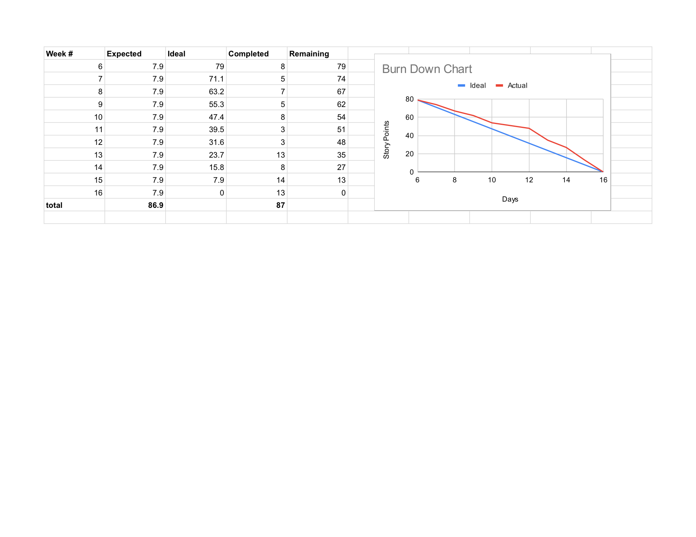

# ProcessCard

ProcessCard is an AWS Lambda–backed payment router. Merchants send a single JSON payload (bank, merchant credentials, card fields, amount, and metadata). The function validates the merchant against DynamoDB, builds the correct request for one of six partner bank APIs, and returns a normalized outcome message. Every attempt is logged to the `Transaction` DynamoDB table for auditing and reporting.

The design goal is a stable public contract: callers only see a small set of allowed messages (for example `Approved.` or `Declined - Insufficient Funds.`), while transient bank failures map to `Error - Bank Not Available.` and unsupported bank names to `Error - Bank Not Supported.` A modular layout also lives under `src/` (`lambda_handler.py` and `bank_payloads/`) for the same behavior split into smaller modules.

## Burndown (project tracking)

The burndown chart below tracks work remaining over time for this project. A PDF copy is in `assets/pdfs/Kyanne_Burndown_Chart - Sheet1 Final.pdf`.



## Repository layout

| Path | Purpose |
|------|---------|
| `processCard.py` | Main Lambda handler (single file, commonly deployed as the function entrypoint) |
| `src/` | Same logic organized into `lambda_handler.py` and `bank_payloads/*` |
| `data/` | Test merchants and account CSVs |
| `text/` | `urls.txt` and simulator `transaction_log.txt` |
| `assets/pdfs/` | Diagrams and burndown PDFs |
| `assets/images/` | README screenshots (e.g. burndown PNG) |
| `grading/` | `grade_apis.py` and `grading_report.txt` |
| `TestingSimulator/` | Load generator and CSV output for graphs |
| `docs/` | Bank API documentation and design notes |

## Quick start

```bash
pip install -r requirements.txt
```

Run the API grader (from repository root):

```bash
python grading/grade_apis.py
```

Run the transaction simulator (set your API URL):

```bash
export MERCHANT_SIMULATOR_API_URL="https://YOUR_API.execute-api.REGION.amazonaws.com/default/processCard"
python TestingSimulator/merchant_simulator.py --assignment --count 500 --workers 10 --out-csv TestingSimulator/results.csv
```

## Environment variables

| Variable | Default | Description |
|----------|---------|-------------|
| `AWS_REGION` | `us-west-2` | AWS region for DynamoDB |
| `MERCHANT_TABLE` | `Merchant` | Merchant lookup table |
| `TRANSACTION_TABLE` | `Transaction` | Transaction log table |
| `CORBIN_USERNAME` / `CORBIN_PASSWORD` | — | Corbin Bank HTTP headers |
| `CALIBEAR_CLEARINGHOUSE_ID` | — | CaliBear body field |

## Request and response shape

Incoming body fields include `bank`, `merchant_name`, `merchant_token`, `card_holder`, `cc_number`, `card_type`, `cvv`, `exp_date`, `amount`, `card_zip`, and `timestamp`. The Lambda responds with JSON `{"message": "<one of the allowed outcomes>"}`.
